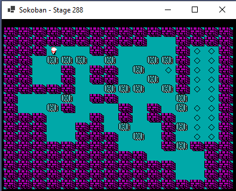

# Sokosharp
Sokosharp is an implementation of the famous game Sokoban in .NET. 
It is an exercise to use modern .NET 5 technology to implement it. Currently it uses Windows Form as UI and System.Drawing as rendering technology.
The objective behind this is the implementation of a tile-based framework to implements '80 style games.
## 2021.01.04
- The game is playable with movements, but does not track any step count or finish recognition.
- Graphics was ripped from old MS-DOS CGA graphics (very nice!)

- It is in 1:1 scale: zoom will be implemented soon